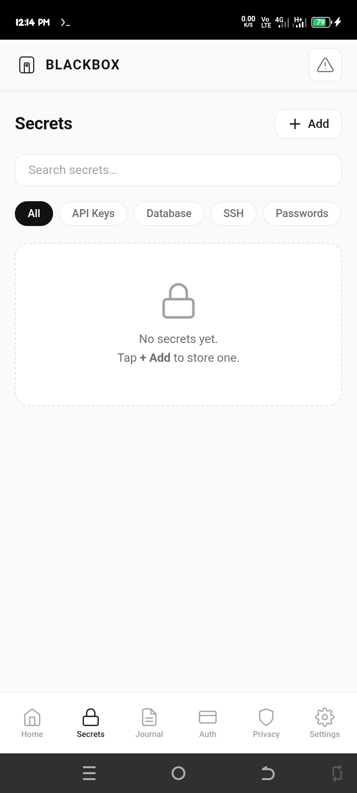
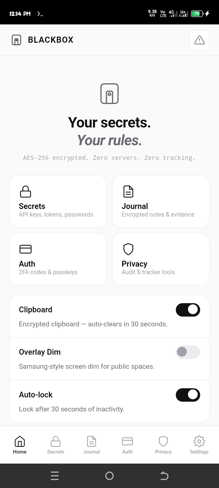

# BLACKBOX 🔒

<div align="center">

[](LICENSE)
[](https://developer.android.com)
[](https://csrc.nist.gov/publications/detail/fips/197/final)
[](https://f-droid.org)

**BLACKBOX** is an offline, security-first hub for developers and creators. Featuring an encrypted secrets manager, private journal, 2FA authenticator, and comprehensive privacy tools, BLACKBOX ensures 100% on-device processing and zero cloud exposure.

[Report Bug](https://github.com/alpha-1-design/Blackbox/issues) · [Contributing](./CONTRIBUTING.md)

<div align="center">
  
  
</div>

</div>

---

## 🚀 Key Features

*   **Secrets Manager:** Securely store API keys, tokens, and credentials with a master PIN-locked vault.
*   **Encrypted Journal:** Maintain secure, timestamped logs with AES-256-GCM entry-level encryption.
*   **TOTP Authenticator:** Full RFC 6238-compliant 2FA generator with Base32 decoding.
*   **Privacy Toolkit:** Integrated URL tracker stripping, browser fingerprinting analysis, and phishing detection.
*   **Hardened Security:** Features `FLAG_SECURE` (blocks screen recording), biometric unlock, shake-to-lock, and a calculator decoy mode.

---

## 🏗️ Technical Architecture

BLACKBOX is engineered for high-assurance privacy:
*   **Encryption:** AES-256-GCM using Web Crypto API.
*   **Key Derivation:** PBKDF2-SHA256 with 150,000 iterations.
*   **Storage:** 100% localized in `localStorage` (encrypted blobs); no network traffic or cloud sync.
*   **Native Integration:** Android-native implementation via Capacitor for biometric security and overlay protection.

---

## 🛠️ Quick Start (Development)

```bash
# Clone the repository
git clone https://github.com/alpha-1-design/Blackbox.git
cd Blackbox

# Install dependencies
npm install

# Initialize Capacitor
npx cap init BLACKBOX com.blackbox.app --web-dir www

# Add Android platform and build
npx cap add android
npx cap sync android
cd android && ./gradlew assembleDebug
```

---

## 🔒 Security Model

BLACKBOX assumes a "Zero-Trust" posture:
1.  **Fresh Derivation:** The master key is derived directly from your PIN in memory and destroyed upon session termination.
2.  **No Persistence of Secrets:** Your PIN is never stored; only an encrypted verifier is used to validate identity.
3.  **Tamper Detection:** AES-256-GCM mode provides authenticated encryption, ensuring data has not been modified by external processes.

---

## 📜 Contributing & Community

We are committed to building the most robust privacy toolset in the ecosystem. Please see our [Contributing Guide](./CONTRIBUTING.md) and [Code of Conduct](./CODE_OF_CONDUCT.md).

Distributed under the **MIT License**. Built for the Alpha-1 Ecosystem.
